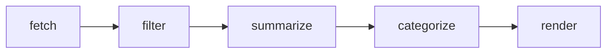

# AI News Digest

A [LangGraph](https://langchain-ai.github.io/langgraph/) workflow that pulls
recent AI news from multiple RSS sources, summarizes each item, classifies it,
and writes a dated markdown digest.

**Part of a larger portfolio:** [ai-ml-portfolio](https://github.com/spmurphy-ml/ai-ml-portfolio) — production AI/ML work at enterprise scale.
Built as a working example of a multi-node agentic pipeline — state management,
node composition, and graceful degradation when an upstream source fails.

## The graph



| Node | Responsibility |
|---|---|
| `fetch` | Pull entries from every configured feed; record failures rather than raising |
| `filter` | Keep items inside the date window, sort newest first, cap the count |
| `summarize` | Two-sentence summary per item via LLM, with an extractive fallback |
| `categorize` | Assign one of five categories, with a keyword fallback |
| `render` | Group by category and write `digest-YYYY-MM-DD.md` |

State is a single `TypedDict` passed between nodes. Each node returns a partial
update that LangGraph merges, so nodes stay independent and individually
testable.

## Design notes

**Multiple sources, no single point of failure.** RSS feeds move and break.
A dead source degrades the output and gets reported in the digest footer
rather than killing the run.

**Runs with or without an API key.** If `ANTHROPIC_API_KEY` isn't set, the
summarize and categorize nodes fall back to extractive and keyword methods.
The graph still executes end to end, which makes it easy to work on the
pipeline without spending tokens on every iteration.

## Setup

```bash
python3 -m venv .venv
source .venv/bin/activate
pip install -r requirements.txt

cp .env.example .env      # then add your key
```

## Usage

```bash
python main.py                          # last 7 days, 12 items
python main.py --days 3 --max-items 20
```

Output lands in `digest-YYYY-MM-DD.md`.

## Sources

- The Batch (DeepLearning.AI)
- Hugging Face Blog
- Google AI Blog
- arXiv cs.AI

Edit the `FEEDS` list in `main.py` to change them.
